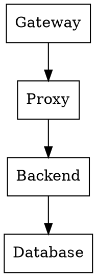
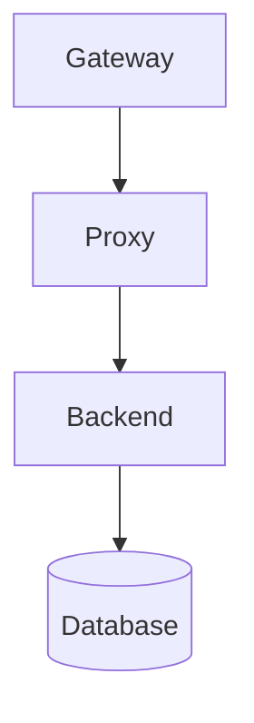

# 让龙虾学会画架构图

龙虾画架构图，需要安装工具。两个选择：Graphviz 或 Mermaid CLI。

---

## 一、Graphviz：专业绘图

Graphviz 是 AT&T 实验室开源的图论可视化工具，用 DOT 语言描述图形，自动布局生成图片。

### 核心特点

| 特点 | 说明 |
|------|------|
| **自动布局** | 算法自动计算节点位置 |
| **DOT 语言** | 简单文本描述图形结构 |
| **多种布局** | dot（有向图）、neato（无向图）、circo（圆形） |
| **输出格式** | PNG、SVG、PDF |

### 安装

```bash
# Linux
apt install graphviz   # Debian/Ubuntu
dnf install graphviz   # CentOS/Fedora

# 验证
dot -V
```

### 语法示例



### 生成图片

```bash
echo 'digraph G { A -> B; }' | dot -Tpng -o output.png
```

### 优缺点

| 优点 | 缺点 |
|------|------|
| 自动布局，处理复杂图形 | 语法繁琐 |
| 支持大规模节点（上千个） | 默认样式简陋 |
| 输出格式多样 | 学习成本较高 |

---

## 二、Mermaid CLI：现代文档

Mermaid 是为 Markdown 文档设计的绘图工具，GitHub 原生支持，在代码块中直接渲染。

### 核心特点

| 特点 | 说明 |
|------|------|
| **类 Markdown** | 语法接近自然语言 |
| **GitHub 支持** | 原生渲染，无需插件 |
| **图表类型** | 流程图、时序图、甘特图、ER图 |
| **浏览器渲染** | SVG/Canvas |

### 安装

```bash
# npm 全局安装
npm install -g @mermaid-js/mermaid-cli

# 验证
mmdc --version
```

### 语法示例



### 生成图片

```bash
mmdc -i input.mmd -o output.png
```

### 优缺点

| 优点 | 缺点 |
|------|------|
| 语法简单，易上手 | 布局控制能力弱 |
| GitHub 原生支持 | 大图渲染慢 |
| 默认样式美观 | root 用户有兼容性问题 |

---

## 三、对比与选择

| 对比项 | Graphviz | Mermaid |
|--------|----------|---------|
| **定位** | 专业绘图 | 文档集成 |
| **语法** | DOT 语言 | 类 Markdown |
| **布局** | 算法驱动，精细控制 | 自动布局 |
| **规模** | 支持上千节点 | 适合中小图 |
| **输出** | PNG/SVG/PDF | SVG/Canvas |
| **GitHub** | 需插件 | 原生支持 |
| **root 用户** | ✅ 正常 | ⚠️ 兼容性问题 |

### 选择建议

| 场景 | 推荐 |
|------|------|
| 架构图、依赖图 | Graphviz |
| 时序图、甘特图 | Mermaid |
| GitHub 文档 | Mermaid |
| 大规模图形 | Graphviz |
| root 用户环境 | Graphviz |

---

## 四、实际使用

**推荐方案**：以 Graphviz 为主，Mermaid 为辅。

### 触发词

| 触发词 | 工具 |
|--------|------|
| 架构图、流程图 | Graphviz |
| 时序图、甘特图 | Mermaid（或 Graphviz 替代） |

### 示例：画一个架构图

```
用户：画一个 OpenClaw Monitor 的架构图
```

龙虾自动生成 DOT 代码，调用 Graphviz 输出 PNG。

---

## 五、root 用户注意事项

Mermaid CLI 在 root 用户下有兼容性问题：

```
Error: Running as root without --no-sandbox is not supported
```

**解决方案**：

1. **方案一**：用 Graphviz 替代
2. **方案二**：创建非 root 用户运行 mmdc
3. **方案三**：使用在线渲染（GitHub）

**实际方案**：Graphviz 作为主力工具，稳定可靠，中文支持好。

---

现在，你也可以让你的龙虾学会画架构图了。 🦐
