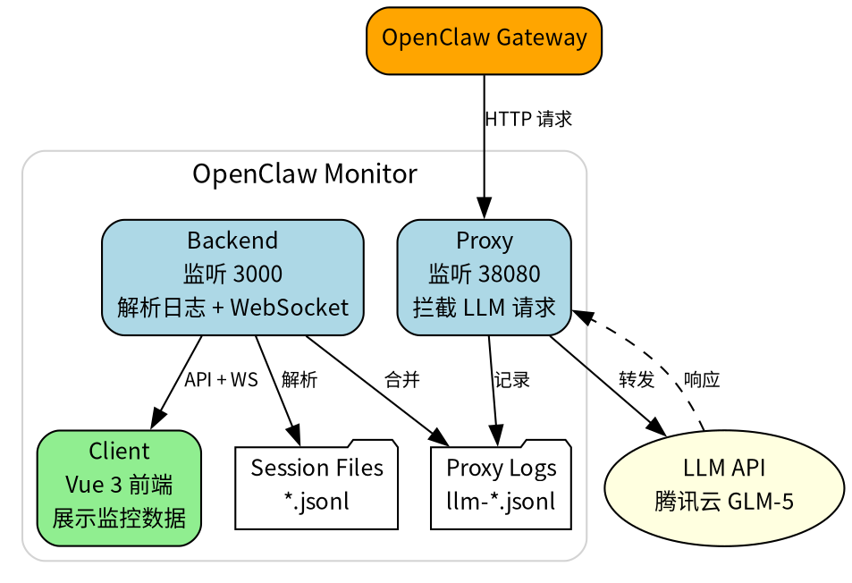

# 让龙虾学会画架构图

需要画架构图时，怎么让龙虾帮你完成？

---

## 核心结论

AI Agent 画架构图，是从"工具"向"解决方案"的演进。

成功的关键：**技能封装 + 工具选择 + 提示词设计 + 用户交互**。

---

## 一、技能封装：模块化设计

将"画架构图"拆解为可复用的模块。

### 模块划分

| 模块 | 职责 |
|------|------|
| 需求分析 | 理解用户想要什么 |
| 架构设计 | 决定组件和关系 |
| 图表生成 | 转换成可视化输出 |

### 工具封装原则

| 原则 | 说明 |
|------|------|
| **语义化** | 工具名称清晰表达意图 |
| **单一化** | 一个工具专注一个任务 |
| **高效化** | 输出精简、结构化 |

**示例**：

```
analyze_codebase(path)     # 分析代码结构
search_patterns(query)     # 检索架构模式
generate_diagram(spec)     # 生成架构图
```

---

## 二、工具选择：能力扩展

Agent 本身不会画图，需要调用外部工具。

### 核心工具类型

| 类型 | 用途 | 示例 |
|------|------|------|
| 代码分析 | 理解现有系统 | 静态分析、依赖解析 |
| 知识检索 | 获取最佳实践 | RAG、知识库 |
| 绘图生成 | 可视化输出 | Mermaid、Graphviz |

### 选择原则

1. **功能单一**：避免功能重叠
2. **输出精简**：返回结构化数据，不返回冗长日志
3. **容错设计**：明确异常处理

---

## 三、提示词设计：引导思维

通过提示词定义 Agent 的"思维蓝图"。

### 系统提示词结构

```markdown
<角色定义>
你是资深系统架构师。

<核心指令>
根据用户需求，设计并绘制清晰的系统架构图。

<工具使用指南>
- 分析代码：analyze_codebase(path)
- 检索模式：search_patterns(query)
- 生成图表：generate_diagram(spec)

<输出格式>
架构图 + 设计说明
```

### 提示链设计

复杂任务拆解为链式子任务：

```
需求理解 → 系统分析 → 架构设计 → 图表生成
```

---

## 四、用户交互：迭代优化

首次输出可能不完美，需要迭代。

### 交互模式

| 模式 | 说明 |
|------|------|
| **迭代探索** | 提供"重新生成"、"调整建议"选项 |
| **可编辑输出** | 支持用户直接编辑生成结果 |
| **上下文管理** | 动态加载相关文档，避免窗口溢出 |

### 上下文工程

| 策略 | 说明 |
|------|------|
| **预加载核心** | 项目文档、架构规范 |
| **动态检索** | 按需加载细节文件 |
| **长时记忆** | 压缩历史对话，保留关键决策 |

---

## 五、实施流程

构建"会画架构图"的 Agent：

```
定义目标 → 数据准备 → 选择技术栈 → 设计架构 → 开发集成 → 测试验证 → 部署优化
```

### 关键步骤

**步骤一：定义范围**

明确支持的架构图类型：
- 微服务架构
- 数据流图
- 部署图

**步骤二：选择工具**

| 工具 | 用途 |
|------|------|
| Graphviz | 自动布局架构图 |
| Mermaid | 简单语法生成图 |
| PlantUML | 专业 UML 图 |

**步骤三：设计提示词**

定义 Agent 角色、指令、工具、输出格式。

**步骤四：测试验证**

- 单元测试：工具调用正确性
- 集成测试：完整设计流程
- 用户测试：验收反馈

---

## 六、最佳实践总结

| 实践 | 核心要点 |
|------|---------|
| **技能封装** | 模块化、语义化、工具化 |
| **工具选择** | 单一职责、高效输出、容错设计 |
| **提示词设计** | 结构化、链式化、路由化 |
| **用户交互** | 迭代优化、可编辑、上下文管理 |

---

## 架构图示例



---

你的龙虾，现在可以学会画架构图了。 🦐
