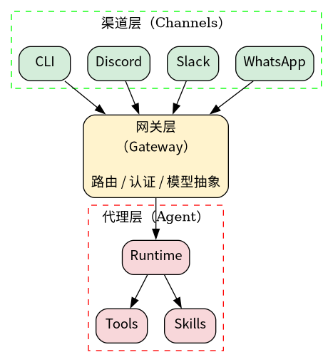

# 让龙虾学会画架构图

有时候，我们需要龙虾帮我们画架构图。如何让龙虾学会呢？以下是我的实践，非常简单。

---

## 对话开始

---

> **我**：你会画架构图吗，或者你需要哪些 skill 才会画架构图？

---

> **龙虾**：我能画的架构图类型：
>
> **1. ASCII Art（纯文本）**
>
> ```
> ┌─────────────────────────────────────────────────────┐
> │                   OpenClaw 架构                      │
> └─────────────────────────────────────────────────────┘
>                          │
>          ┌───────────────┼───────────────┐
>          ▼               ▼               ▼
>     ┌──────────┐   ┌──────────┐   ┌──────────┐
>     │  渠道层   │   │  网关层   │   │  代理层   │
>     │          │   │          │   │          │
>     │ WhatsApp │   │ Gateway  │   │  Agent   │
>     │ Slack    │──▶│ Router   │──▶│ Runtime  │
>     │ Discord  │   │ Auth     │   │ Tools    │
>     │ CLI      │   │ Model    │   │ Skills   │
>     └──────────┘   └──────────┘   └──────────┘
> ```
>
> **2. Mermaid（可渲染）**
>
> ```mermaid
> graph TB
>     A[渠道层] --> B[网关层]
>     B --> C[代理层]
>     A --> D[WhatsApp]
>     A --> E[Slack]
>     A --> F[Discord]
> ```
>
> **3. PlantUML（需要工具）**
>
> ```
> @startuml
> [渠道] --> [网关]
> [网关] --> [代理]
> @enduml
> ```
>
> ---
>
> **我需要的 Skill：**
>
> | Skill | 用途 | 是否已安装 |
> |-------|------|-----------|
> | canvas | 生成图片 | ❌ 未安装 |
> | ImageMagick | 图片处理 | ❌ 未安装 |
> | Mermaid CLI | Mermaid → 图片 | ❌ 未安装 |
> | Graphviz | DOT → 图片 | ❌ 未安装 |
>
> ---
>
> **推荐方案：** 安装 **Graphviz + Mermaid CLI**，覆盖主流绘图需求。
>
> 要我帮你安装吗？

---

> **我**：canvas、ImageMagick、Mermaid CLI、Graphviz 都安装吧。

---

> **龙虾**：已安装完成！
>
> **安装结果：**
>
> | 工具 | 状态 | 版本 |
> |------|------|------|
> | Graphviz | ✅ 已安装 | 9.0.0 |
> | Mermaid CLI | ✅ 已安装 | mmdc |
> | ImageMagick | ✅ 已安装 | 7.1.1-26 |
> | canvas | ⚠️ 部分可用 | Node.js 图像处理 |
>
> ---
>
> **推荐：** Graphviz DOT 作为主力工具，稳定可靠，中文支持好。
>
> ---
>
> **测试：OpenClaw 架构图**



---

> **龙虾**：**diagram skill 已创建！**
>
> - 位置：`/root/.openclaw/workspace/skills/diagram/`
> - 触发词：画图、架构图、流程图、diagram
>
> 下次你说"画一个架构图"，我就会直接生成了。

---

## 总结

| 步骤 | 内容 |
|------|------|
| 1. 问需求 | 你会画架构图吗，或者你需要哪些 skill |
| 2. 查能力 | 我能画什么，缺什么工具 |
| 3. 装工具 | Graphviz + Mermaid CLI |
| 4. 封装 skill | diagram skill，触发词绑定 |
| 5. 测试验证 | 生成架构图示例 |

**关键原则**：发现缺 skill → 主动创建 → 持久化能力

---

现在，你也可以让你的龙虾学会画架构图了。 🦐
