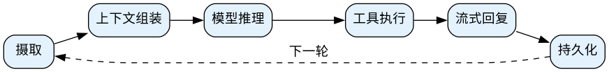
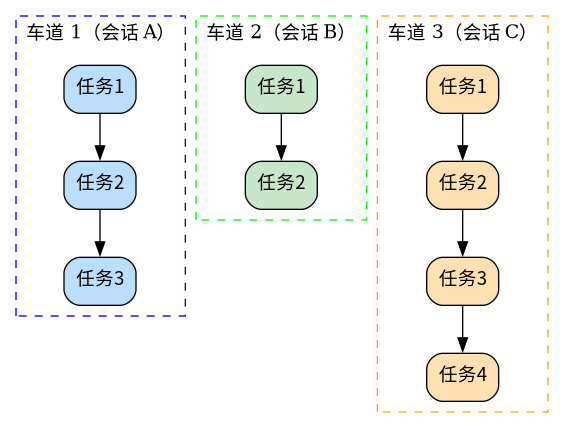
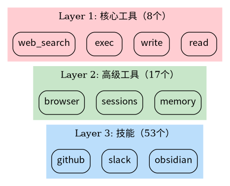

# OpenClaw 架构原理：揭开"自主 AI"的神秘面纱

> OpenClaw 为什么能"自己做事"？它真的在后台思考吗？答案藏在工程架构里，而非魔法。

## 引言：从聊天机器人到自主代理

2026 年，AI 领域最大的变化不是模型变聪明了，而是 AI 开始"自己做事"了。

OpenClaw 作为最火的开源 AI Agent 项目，让很多人第一次体验到：AI 不只是回答问题，还能主动发消息、执行命令、管理日程。你甚至不用问它，它自己就知道该做什么。

**但 OpenClaw 的"自主性"并非魔法。** 当你理解了它的架构，就会发现：它只是一个设计精良的工程系统，每一步"自主行为"都有迹可循。

---

## 一、网关：一切的中枢

OpenClaw 的第一个关键设计是"网关"（Gateway）。

### 想象一个公司前台

所有来访都要经过前台：
- 验证身份
- 分配任务
- 协调资源

不同部门（WhatsApp、Slack、Discord）互不干扰，一个部门出问题不影响其他部门。

**网关就是这个前台。**

### 三层架构


### 为什么这样设计？

传统 AI 工具的问题是：渠道和"大脑"绑在一起。比如一个 Telegram 机器人，Telegram 挂了，整个 AI 就不可用。

OpenClaw 把它们分开：

```
渠道层（接收消息）→ 网关层（路由+认证）→ 代理层（执行任务）
```

**渠道即插件**——一个挂了，其他照常工作。

### 输入不止是聊天

传统聊天机器人只处理用户消息。OpenClaw 的网关还处理：

| 输入类型 | 例子 | 作用 |
|---------|------|------|
| 用户消息 | "帮我查天气" | 响应式 |
| 心跳 | 每 30 分钟检查 | 主动式 |
| 定时任务 | 每天 9 点发日程 | 计划式 |
| Webhook | 收到邮件触发处理 | 事件式 |

**时间和状态是一等公民**。这就是 OpenClaw 能"主动"的秘密——它不只是等输入，时间到了就会自己行动。

---

## 二、代理循环：消息如何变成行动

OpenClaw 的"大脑"如何工作？答案是一个循环：



### 每一步在做什么？

| 步骤 | 说明 | 类比 |
|------|------|------|
| 摄取 | 接收消息，确定会话 | 接信 |
| 上下文组装 | 加载历史、技能、提示 | 准备材料 |
| 模型推理 | 调用 LLM 决定行动 | 思考 |
| 工具执行 | 执行 LLM 决定的操作 | 动手 |
| 流式回复 | 边生成边发送 | 回信 |
| 持久化 | 保存对话记录 | 归档 |

### 没有后台思考

很多人以为 OpenClaw 有一个"后台思考进程"，一直在琢磨事情。**这是误解**。

OpenClaw 的"自主性"来自事件驱动：

```
时间到了 → 创建事件 → 网关路由 → 代理运行 → 状态写入 → 工具执行 → 结果交付
```

**没有神秘思考，只有严谨循环。**

---

## 三、车道队列：为什么日志不乱

用过其他 AI Agent 的人都知道：日志经常乱七八糟，因为多个任务同时执行，互相干扰。

OpenClaw 用"车道队列"（Lane Queue）解决这个问题。

### 什么是车道？



每个会话有自己的"车道"，同一车道内的任务串行执行，不同车道可以并行。

### 传统方案 vs OpenClaw

| 问题 | 传统方案 | OpenClaw |
|------|---------|---------|
| 竞争条件 | 多任务同时改文件 → 冲突 | 同会话串行 → 无冲突 |
| 日志混乱 | 多任务日志交织 | 每车道独立 → 可读 |
| 状态损坏 | 并发写入丢数据 | 序列化 → 一致 |

**默认串行，显式并行**——这是稳定的秘诀。

---

## 四、工具与技能：能做什么 vs 怎么做

OpenClaw 能做什么？取决于两层能力。



### 工具 = 器官（能做什么）

| 层级 | 工具 | 能力 |
|------|------|------|
| Layer 1 | read, write, exec | 文件、命令、网络 |
| Layer 2 | browser, memory | 浏览器、记忆 |

没有 `exec` 工具，就无法执行命令。没有 `browser` 工具，就无法操作网页。

### 技能 = 教科书（怎么做）

- `github` 技能：教它操作 Git 仓库
- `obsidian` 技能：教它管理笔记
- `slack` 技能：教它发 Slack 消息

**关键区别**：安装技能 ≠ 获得权限。实际能力由 `tools.allow` 控制。

### 三者缺一不可

让 OpenClaw 通过 Gmail 发邮件：

1. **配置**：允许执行命令（`exec` 工具）
2. **安装**：安装 `gog` 桥接工具
3. **授权**：登录 Google 账号

技能只是说明书，真正干活需要工具和授权。

---

## 五、安全机制：多层防护

让 AI 执行命令是危险的。OpenClaw 用多层防护：

### 第一层：允许列表

只有预批准的命令能执行：

```json
{
  "tools": {
    "allow": {
      "exec": ["npm", "git", "ls"]
    }
  }
}
```

### 第二层：结构阻断

即使命令在列表中，也会解析并阻断危险模式：

| 模式 | 例子 | 危险原因 |
|------|------|---------|
| 重定向 | `cmd > file` | 覆盖系统文件 |
| 命令替换 | `$(cmd)` | 嵌套危险命令 |
| 子 shell | `(cmd)` | 逃逸上下文 |
| 链式执行 | `cmd1 && cmd2` | 多步攻击 |

### 第三层：沙箱隔离

敏感操作在 Docker 容器中执行，出问题不影响主机。

---

## 六、记忆 vs 上下文

这两个概念容易混淆：

| 概念 | 说明 | 特点 |
|------|------|------|
| 上下文 | 模型当前看到的 | 受 token 限制，会遗忘 |
| 记忆 | 持久化存储的 | 保存在磁盘，可搜索 |

**核心原则**：上下文会遗忘，记忆会持久。

---

## 七、对比：OpenClaw vs 传统方案

| 特性 | 传统 Agent | OpenClaw |
|------|-----------|---------|
| 并发 | 随机异步 → 日志乱 | 车道队列 → 有序 |
| 可观测性 | 日志难读 | JSONL 可重放 |
| 安全 | 提示词约束 | 多层硬防护 |
| 网页浏览 | 截图（贵慢） | 语义快照（快准） |
| 记忆 | 仅向量库 | Markdown + 向量 |

---

## 结语：架构即自由

OpenClaw 证明了一件事：**自主性不是魔法，是工程**。

- 网关解耦渠道 → 系统稳定
- 车道队列 → 日志可读
- 多层防护 → 危险可控
- 工具技能分离 → 能力可扩展

理解这些原理，你才能更好地配置、监控、扩展你的 OpenClaw。

**架构清晰了，自由就来了。**

---

*本文基于 OpenClaw 官方文档和社区分析整理。*
